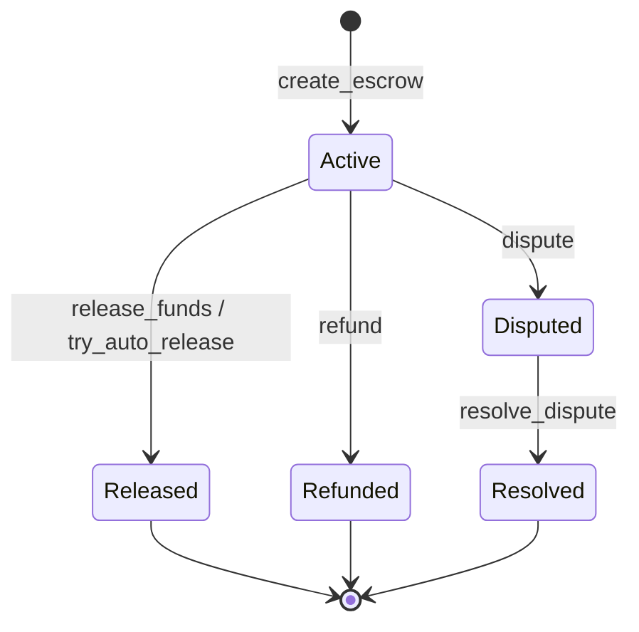
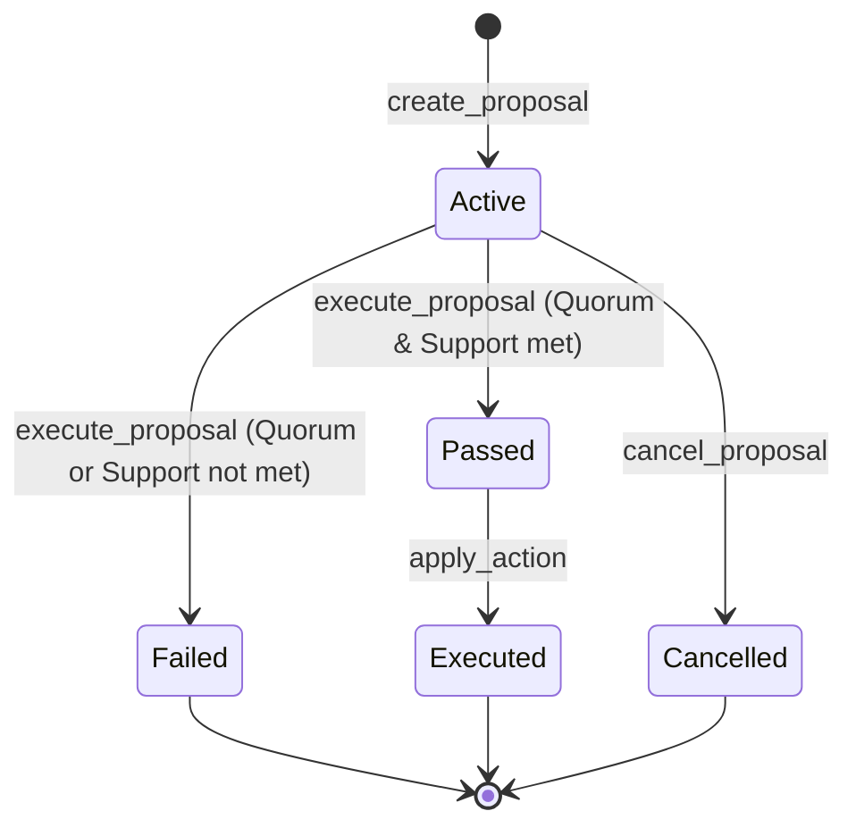
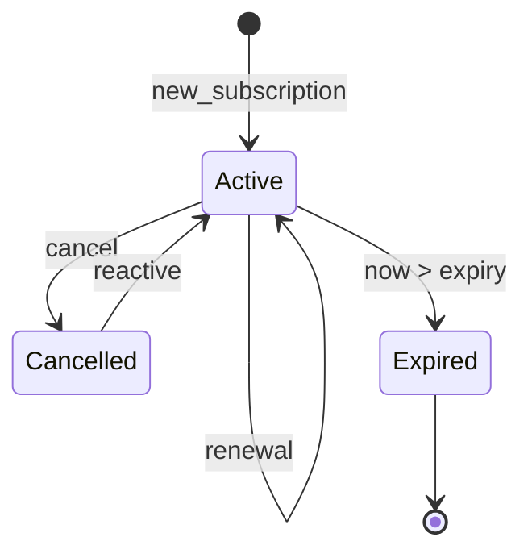
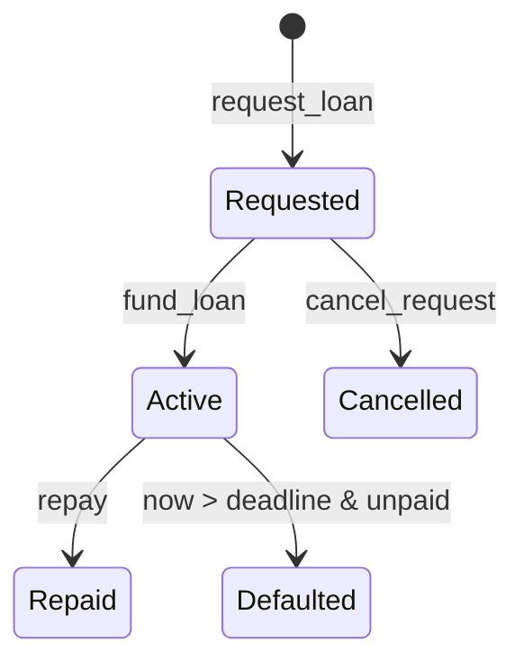
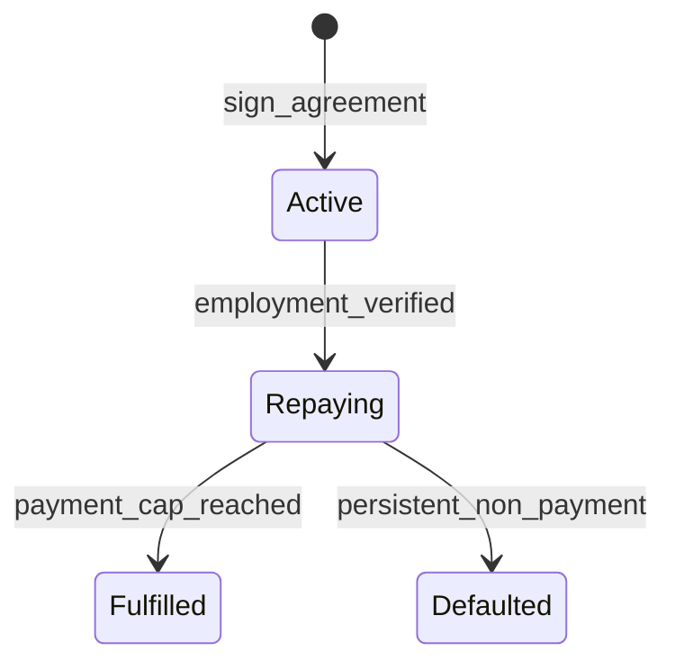

# State Machine Specification

This document formally specifies the state machines for all MentorsMind contracts. These specifications serve as the ground truth for contract behavior and are used to generate verification tests.

## 1. Escrow State Machine

The Escrow contract manages funds between a Learner and a Mentor, with potential for disputes and arbitration.

### Transitions

| From | To | Trigger | Preconditions |
|------|----|---------|---------------|
| `[*] ` | `Active` | `create_escrow` | Approved token, positive amount |
| `Active` | `Released` | `release_funds` | Learner or Admin auth |
| `Active` | `Released` | `try_auto_release` | `now >= session_end + delay` |
| `Active` | `Disputed` | `dispute` | Mentor or Learner auth |
| `Active` | `Refunded` | `refund` | Admin only |
| `Disputed` | `Resolved` | `resolve_dispute` | Admin only |

---

## 2. Governance Proposal State Machine

Governance proposals allow MNT token holders to vote on protocol changes.

### Transitions

| From | To | Trigger | Preconditions |
|------|----|---------|---------------|
| `[*] ` | `Active` | `create_proposal` | Proposer auth |
| `Active` | `Passed` | `execute_proposal` | `now > voting_ends`, Quorum reached, Vote ratio > 50% |
| `Active` | `Failed` | `execute_proposal` | `now > voting_ends`, Quorum not reached OR Vote ratio <= 50% |
| `Active` | `Cancelled` | `cancel_proposal` | Admin only |
| `Passed` | `Executed` | `apply_action` | Action successfully applied |

---

## 3. Subscription State Machine

Manages recurring payments for platform services.

### Transitions

| From | To | Trigger | Preconditions |
|------|----|---------|---------------|
| `[*] ` | `Active` | `new_subscription` | Valid payment |
| `Active` | `Active` | `renewal` | Successful payment |
| `Active` | `Cancelled` | `cancel` | User auth |
| `Active` | `Expired` | `timeout` | `now > expiry` |
| `Cancelled`| `Active` | `reactive` | Successful payment |
| `Expired` | `[*] ` | `cleanup` | None |

---

---

## 4. Loan State Machine

Manages lending and borrowing of assets.

### Transitions

| From | To | Trigger | Preconditions |
|------|----|---------|---------------|
| `[*] ` | `Requested` | `request_loan` | Valid collateral/terms |
| `Requested`| `Active` | `fund_loan` | Lender auth, funds transferred |
| `Active` | `Repaid` | `repay` | Full amount paid |
| `Active` | `Defaulted` | `timeout` | `now > deadline` & unpaid |
| `Requested`| `Cancelled` | `cancel_request` | Borrower auth |

---

## 5. ISA (Income Share Agreement) State Machine

Manages agreements where leaners pay back a percentage of future income.

### Transitions

| From | To | Trigger | Preconditions |
|------|----|---------|---------------|
| `[*] ` | `Active` | `sign_agreement` | Learner auth |
| `Active` | `Repaying` | `verify_employment` | Proof of income |
| `Repaying` | `Fulfilled` | `repay` | Total cap reached |
| `Repaying` | `Defaulted` | `non_payment` | Missed payment window |

## Methodology

1. **Formal Definition**: States are defined as Enums in the contract.
2. **Transition Validation**: Every state change must be validated by the `StateMachine` trait.
3. **Automated Testing**: Test cases are generated for every valid and invalid transition defined here.
